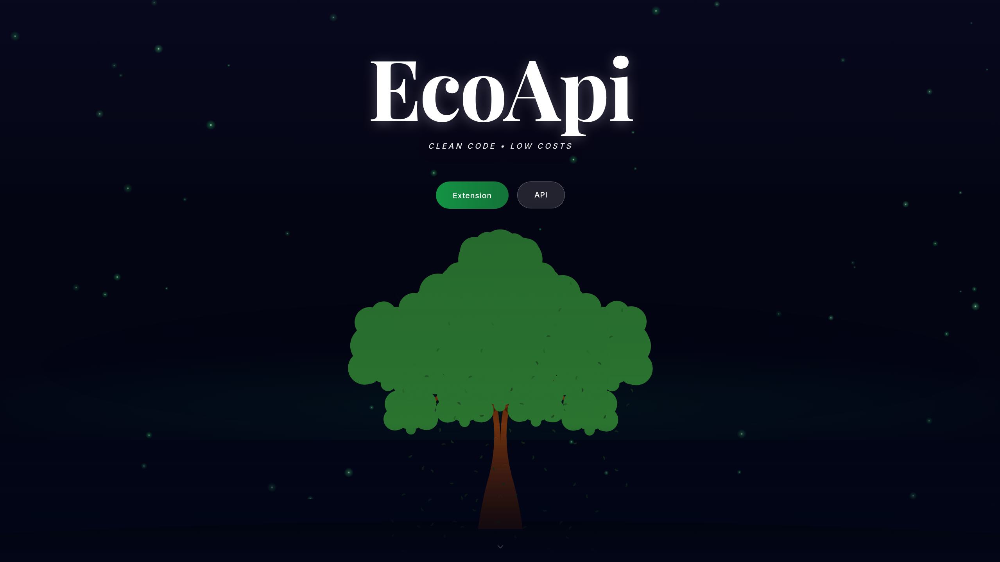

# EcoAPI - Documentation Site

Public-facing documentation and landing page for [EcoAPI](https://ecoapi.dev).



## What's Here

React + Vite documentation site deployed at **https://ecoapi.dev**.

## Setup

```bash
npm install
npm run dev
```

## Commands

| Command | Description |
|---------|-------------|
| `npm run dev` | Start local dev server |
| `npm run build` | Production build |
| `npm run preview` | Preview production build |

Run from root.

## Related Repos

- **API** - Cloudflare Workers backend
- **Extension** - VSCode extension + dashboard

---

Licensed under the [GNU Affero General Public License v3.0](LICENSE) © 2026 Andres Lopez, Aslan Wang, Donggyu Yoon.
